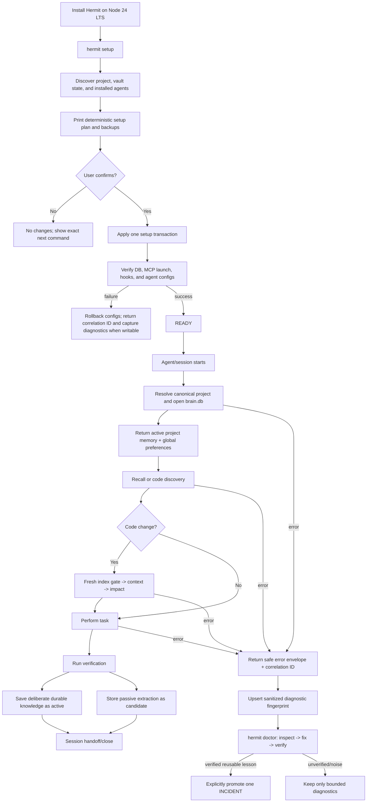
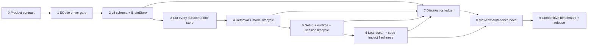

# Hermit Graph v8 Product Truth Implementation Plan

> **For agentic workers:** REQUIRED SUB-SKILL: use `superpowers:executing-plans` to execute this plan one phase at a time, `superpowers:test-driven-development` for every behavior change, and `superpowers:verification-before-completion` before closing each phase.

**Goal:** Make Hermit a trustworthy local-first developer brain: one authoritative knowledge store, one consistent user lifecycle across supported coding agents, offline lexical recall by default, explicit local semantic installation, fresh code-impact evidence, and durable privacy-safe diagnostics.

**Architecture:** A single SQLite `brain.db` is the only runtime knowledge authority. Every CLI, MCP tool, hook, scanner, viewer, and maintenance command uses the same application services and path resolver. FTS5 lives in the same database; optional embeddings are derived data. Project code indexes remain rebuildable caches, never a second brain. Operational errors live in `diag_*` tables in the same database. A tiny bounded crash capsule is allowed only when SQLite cannot open, then is ingested exactly once and removed or quarantined.

**Tech Stack:** Node.js 24 LTS, `node:sqlite` if the cross-platform POC gate passes, SQLite WAL + FTS5, MCP SDK, Zod, ast-grep, optional local-only Transformers.js model, Node test runner plus the existing regression suites.

---

## Document authority

- **Status:** Windows RC acceptance completed at `4ce5355`, including CLI/hook correlation and boot/retention tests. The final 8.0.0-rc.0 preflight passed; npm publication completed: next=8.0.0-rc.0, latest=7.1.0, registry integrity verified. Broader platform/client qualification remains follow-up work documented in reconstruction-ledger.md.
- **2026-09-09 release scope override (user approved):** complete CLI/hook correlation and boot/retention acceptance on Windows, then publish `8.0.0-rc.0` with npm tag `next`. macOS/Linux qualification is deferred and does not block this candidate. This does not authorize promoting `latest` or claiming every client/platform has been interactively tested.
- **Decision date:** 2026-09-07.
- **Primary user:** one local developer using multiple coding agents. Team cloud sync, RBAC, and hosted SaaS are not v8 goals.
- **Evidence baseline:** `release/v7.1.0` plus the uncommitted audit fixes present on 2026-09-07. Re-check line numbers before implementation because the worktree is dirty.
- **Supersedes:**
  - `plans/260504-1648-hermes-pattern-adoption/plan.md` for the dual-store and `sqlite-vec` architecture.
  - `plans/260907-1100-hermit-audit-fixes/plan.md` for the later JSONL-authority conclusion. Its completed bug fixes and measurements remain historical evidence.
  - `plans/reports/handoff-260907-1456-hermit-architecture-review.md` as an open-decision handoff. The report remains evidence, not product direction.
- **Machine-readable supersession:** `plans/supersession-manifest.json` recursively marks both conflicting plan directories and the exact handoff file as historical.
- **Destructive boundary:** this plan authorizes design and implementation work, not deletion of the current user vault. Before a real reset, print exact absolute targets, create/verify a backup, and obtain an explicit confirmation for those targets.

## Product promise and boundary

Hermit v8 should be able to make this narrow promise truthfully:

> Install once, connect the coding agents you actually use, and give them one local brain that remembers curated engineering knowledge, links business rules to code impact, and preserves verified debugging lessons without silently downloading or uploading anything at runtime.

Hermit is **not** trying to be:

- a full stateful coding-agent runtime like Letta;
- a hosted multi-tenant memory platform like Mem0/Zep;
- the deepest standalone code graph in every language like GitNexus;
- a raw transcript recorder;
- a general GraphQL graph service;
- a two-way live JSONL/SQLite synchronization system.

The defensible v8 differentiator is the combination of:

1. structured engineering knowledge (`BIZ`, `PATTERN`, `TECH`, `INCIDENT`) with confidence, date, lifecycle, and provenance;
2. static code context and blast-radius analysis;
3. explicit links from rules/flows/incidents to affected files and symbols;
4. a privacy-safe failure ledger that can promote a *verified* fix into durable incident knowledge;
5. one local authority shared across MCP-compatible coding agents.

This is a target position, not a release claim, until the benchmark gates in this plan pass.

## Non-negotiable invariants

1. **One authority:** only `brain.db` is queried or mutated during normal runtime.
2. **No hidden dual write:** no feature writes JSONL and SQLite for the same logical mutation.
3. **Derived means disposable:** code indexes, FTS rows, and embeddings carry a source revision and can be rebuilt without losing knowledge.
4. **No runtime download:** startup, session recall, lexical search, writes, health, impact, and diagnostics make zero network/model-download attempts.
5. **One service per capability:** all surfaces delegate to the same store, retrieval, setup, session, code-index, and diagnostics services.
6. **No silent degradation:** every fallback declares `degraded`, the actual mode used, a stable error code, and a diagnostic reference when applicable.
7. **Safe config mutation:** setup never replaces a user config or instruction file after parse failure; it previews, backs up, patches, verifies, and rolls back.
8. **Freshness before safety claims:** `impact` and pre-edit checks never claim safety from a stale code index.
9. **Curated brain, operational ledger:** raw errors remain diagnostics; only a verified root cause + fix + test may become an `INCIDENT` entity.
10. **Docs are testable contracts:** user-facing claims must map to an automated test or a dated benchmark artifact.

## What may exist beside `brain.db`

| Artifact | Role | Authority? | Required rule |
|---|---|---:|---|
| `brain.db` | Entities, observations, relations, history, provenance, FTS, optional derived embeddings, diagnostics | **Yes** | Only runtime source of knowledge truth |
| Per-project code cache | AST symbols, edges, source hashes, last-good index | No | Rebuildable; never contains irreplaceable memory |
| Model cache | Explicitly installed, pinned local model files | No | Runtime opens local files only; checksum verified |
| User-created backup/export | Recovery or portability snapshot | No | Immutable snapshot; never watched or read as live state |
| Crash capsule directory | Minimal pre-DB fatal records | No | Bounded, redacted, owner-only, imported once, then removed/quarantined |
| Agent config files | MCP/hook integration pointers | No | Contain no duplicate brain content |

The crash capsule is the only justified secondary write path. It exists precisely when the one authoritative database cannot be opened; it cannot answer memory queries and therefore is not a second brain.

### Canonical path resolution

`HERMIT_DATA_DIR` is the only supported root override and must resolve to an absolute directory. Initialization creates a versioned `.hermit-data-root.json` ownership sentinel. Resolve symlinks/junctions before use and reject an override equal to a filesystem root, user-home root, workspace/repository root, npm package root, or any path without the matching sentinel for destructive maintenance. Descendants such as `%LOCALAPPDATA%\HermitGraph` remain valid. Without an override:

| Platform | Data root |
|---|---|
| Windows | `%LOCALAPPDATA%\HermitGraph` |
| macOS | `~/Library/Application Support/HermitGraph` |
| Linux | `${XDG_DATA_HOME:-~/.local/share}/hermit-graph` |

`brain.db`, `models/`, `backups/`, setup manifests, and `crash-spool/` live beneath that data root. Rebuildable project code indexes live under the corresponding OS cache root, keyed by canonical project ID and source fingerprint. The npm package directory and server process cwd are never storage defaults; cwd is only an input to project resolution. Legacy `MEMORY_FILE_PATH` is detected during setup/upgrade and removed or rejected with an exact remediation instead of silently selecting another authority. Agent integration configs outside the data root are mutation/deletion targets only when an exact path and original hash are recorded in a verified setup manifest; they are never reached by recursive data-root cleanup.

## Architecture decisions

| ID | Decision | Rationale | Rejected alternative / revisit condition |
|---|---|---|---|
| ADR-01 | SQLite is the sole runtime knowledge authority | Atomic multi-table mutations, concurrent readers, FTS5, history, archive semantics, diagnostics, and much lower write amplification than rewriting JSONL | JSONL-only is simpler to inspect but weaker for concurrent mutation and transactional semantics. Revisit only if SQLite cannot pass supported-platform gates |
| ADR-02 | Use Node 24 LTS and prefer built-in `node:sqlite` | SQL engine ships with Node, so there is no database package/model fetch during Hermit runtime | Use exact `better-sqlite3@13` behind the same adapter only if the POC fails compatibility, durability, or performance thresholds |
| ADR-03 | FTS5/BM25 is the default retrieval path | Fast, deterministic, offline, and sufficient for exact engineering names and structured observations | Semantic-only default is rejected because it adds model lifecycle, cold start, and hidden download risk |
| ADR-04 | Semantic recall is explicit and optional | Users install a pinned model once; runtime uses local files only | Bundling the model in the base package is rejected due install size/update churn. Add an offline import path instead |
| ADR-05 | Remove `sqlite-vec` from v8 core | Current vault scale does not justify native-extension risk; vectors can be BLOBs with in-memory cosine when semantic mode is installed | Reconsider a vector extension only after a measured threshold, e.g. >100k active embeddings or p95 misses the budget |
| ADR-06 | Hard structural validation, soft completeness validation | Invalid names/types/shapes must not enter the graph; an entity may be incrementally completed without breaking an active session | Free-form schema is rejected. Completeness remains a warning/candidate state rather than a hard transaction failure |
| ADR-07 | Auto-capture produces candidates; deliberate saves produce active knowledge | Prevents regex/transcript noise from polluting default recall | Fully automatic promotion is rejected. Revisit only with a labeled precision benchmark and reversible review UI |
| ADR-08 | Diagnostics use `diag_*` tables in `brain.db` | Preserves one physical authority and enables atomic counters, retention, and incident linkage | A separate `diagnostics.db` is rejected because it creates a second operational authority |
| ADR-09 | No GraphQL in v8 | MCP + CLI + a local viewer cover the solo local product; GraphQL adds schema/auth/query complexity without a user need | Revisit when there are multiple remote non-MCP clients that need arbitrary graph queries and versioned API governance |
| ADR-10 | No automatic legacy conversion in normal startup | The current user accepts a clean reset; silent migration has already caused split-brain and archive loss | Keep a separate, explicit, non-runtime import tool only if external users require it and round-trip tests cover every field |

ADR-10 makes v8 a deliberate clean-vault breaking release for v7 data. Core v8 does **not** promise a v7 -> v8 semantic import. It does promise: (a) a byte-for-byte legacy artifact backup before reset, with instructions for reinstalling v7 and restoring that artifact; and (b) lossless `backup create/verify/restore` for stores that are already v8. Do not use the word “import” in default setup remediation unless a separately tested legacy importer is later approved.

### Technology evidence for the no-runtime-download decision

- Node publishes its release/LTS lifecycle centrally, so v8 can pin one supported Node 24 patch floor instead of supporting several incompatible native-addon combinations: [Node.js releases](https://nodejs.org/en/about/previous-releases).
- `node:sqlite` is distributed with Node itself; Hermit does not need to download a database engine when a request starts: [Node SQLite API](https://nodejs.org/api/sqlite.html).
- Node's vendored SQLite build configuration includes FTS5, which must still be proven by the Phase 1 packaged matrix rather than assumed from a development machine: [Node SQLite build configuration](https://github.com/nodejs/node/blob/main/deps/sqlite/sqlite.gyp).
- If built-in SQLite fails the gate, `better-sqlite3` is installed as a pinned package dependency/prebuild during package installation, not fetched by runtime search: [better-sqlite3 package metadata](https://github.com/WiseLibs/better-sqlite3/blob/master/package.json).
- Transformers.js exposes a local model path/cache and remote-model controls. v8 must set the exact local path and disable remote models after explicit installation: [Transformers.js Node guide](https://github.com/huggingface/transformers.js/blob/main/packages/transformers/docs/source/tutorials/node.md).
- The currently proposed MiniLM ONNX repository shows that quantized and full-precision assets have materially different sizes, which is why the base package must not silently bundle one: [model files](https://huggingface.co/Xenova/all-MiniLM-L6-v2/tree/main/onnx).
- SQLite WAL supports simultaneous readers with one writer; Hermit still needs its own bounded busy/retry and process-concurrency tests: [SQLite WAL documentation](https://www.sqlite.org/wal.html).

## Current flow audit

Severity uses `P0` for data loss, destructive setup, wrong-corpus recall, or false safety; `P1` for broken/inconsistent core experience; `P2` for maintenance and polish.

| Flow | Current paths / surfaces | Finding | Canonical v8 owner | Priority |
|---|---|---|---|---:|
| Install/publish | `package.json`, `publish-preflight.mjs`, README quickstart | Node `>=20`, native SQLite/vector dependencies, optional model behavior, and published claims do not describe one tested install contract | `RuntimeRequirements` + packaged consumer matrix | P1 |
| Setup | `brain-cli.mjs`, `setup-project.mjs`, `setup-module.mjs`, exporters | Three divergent implementations. Default `setup` targets all agents; malformed configs can be replaced; project `AGENTS.md` can be overwritten. Gemini/Codex feature coverage differs from claims | `SetupService.plan/apply/verify/rollback` with declarative adapters | **P0** |
| MCP boot | Top-level work in `hermit-mcp-server.mjs` | Migration/provider/parity work happens before protected `main()`. Startup faults reach stderr only and may prompt/download in the wrong context | Minimal launcher + `McpServerApp` boot state machine | P1 |
| Session start | MCP tool/resource, recall hooks, `session-core.cjs` | Multiple scorers/path rules; MCP description still says branch filtering; hook start/end correlate by short-lived PID, so sessions remain open | `SessionService` + normalized hook events + stable upstream session ID | P1 |
| Project scope | cwd/name heuristics in several modules | Server cwd, package root, user cwd, and project name aliases can select different corpora | `ProjectResolver` with canonical ID, explicit aliases, and cross-project opt-in | **P0** |
| Keyword/BM25 search | memory tool, SQLite FTS helpers, CLI search | Multiple implementations and score scales | `RetrievalService.search(mode='lexical')` | P1 |
| Semantic search | hard-coded `data/brain*`, embedding service, vector adapters | npm install can search package data instead of user vault; default `bm25` falls through to an embedding path | `RetrievalService` + `ModelManager`; dependency-injected paths only | **P0** |
| Unified search | `unified-search.mjs` | `fast=true` can still run semantic code search; fresh code index is not guaranteed; KG/code scores are mixed without calibration | Retrieval fan-out with explicit source calibration and `ensureIndex()` | P1 |
| Entity/observation/relation writes | `memory-module.mjs` | JSONL rewrite then SQLite mirror; duplicated observations; replacement rules archive too broadly | `BrainStore` transaction API | **P0** |
| Hook auto-update | five hook variants + `entity-extractor.cjs` | Direct JSONL append bypasses SQLite; incompatible lock formats; duplicate check happens outside lock | One hook bridge calling `CaptureService`/`BrainStore` | **P0** |
| Archive/history | JSONL metadata + SQLite schema | SQLite drops archive/history/provenance, so archived items can reappear in default reads | Lifecycle columns + append-only change events in SQLite | **P0** |
| Consolidation | `intelligence-module.mjs` | JSONL-only mutation; confidence prefixes defeat contradiction parsing; DB remains stale | `ConsolidationService` over candidates/history | P1 |
| Project learn | `project-learner.mjs`, setup | Deterministic scan writes JSONL directly and generates product claims before business facts are confirmed | `LearnService` writes active deterministic facts and candidate inferences | P1 |
| Deep scan | collector, MCP handoff, command prompt | Phases 0–3 collect but have no explicit persistence transition; 4–8 depend on agent compliance; incremental metadata formats disagree; command references a nonexistent delete tool | `ScanService.collect -> preview -> commit`, one persisted scan run | P1 |
| BUSINESS.md | root file + generator/template | Repository file is an unrelated e-commerce placeholder; README says setup auto-fills correct impact chains | Product-specific impact map; generated content must be marked confirmed/candidate | **P0** |
| Code index build | `codegraph-module.mjs`, `indexer.mjs` | Staleness ignores uncommitted/untracked files; force rebuild clears last-good index before success | `CodeIndexService` with worktree fingerprint and atomic swap | **P0** for impact |
| Code query/context | codegraph tool paths | Useful but response/tool contracts and semantic dependencies differ across surfaces | `CodeGraphService.query/context` | P1 |
| Impact/pre-edit | MCP tool + hook/CLI | Can be based on stale derived state; best-effort framework edges can look definitive | Freshness gate + evidence/confidence + honest unknowns | **P0** |
| Health | CLI JSONL health and MCP health | Different inputs; current score mixes/omits operational truth | `HealthService` with separate Knowledge and Runtime sections | P1 |
| Doctor/traces | npm-only doctor, transcript parser, in-memory stats, opt-in trace JSONL | Retrospective and agent-format fragile; no durable lifecycle/correlation; raw query/args may be retained; CLI help lacks `hermit doctor` | `DiagnosticsRecorder` + `DiagnosticsStore` + CLI/read-only MCP views | P1 |
| Viewer | CLI temp export, static browser loader/export | Wrong default vault possible; viewer export shape cannot be reloaded by its own loader; live truth depends on JSONL snapshot | Read-only local API backed by `BrainStore`; versioned export format | P1 |
| Export/backup | DB-to-JSONL scripts, viewer export | Several incompatible formats; exports can be mistaken for live truth | `BackupService` and `ExportService` with manifest/checksum | P1 |
| Upgrade/migration | boot auto-migrate, `hermit migrate`, vector backfill | Ambiguous commands, prompts in server startup, count-only parity, upsert cannot remove extras | Explicit `hermit upgrade plan/apply/verify/rollback`; no startup migration | **P0** |
| Reset/uninstall | README manual deletion only | Deleting JSONL does not reset SQLite; no scoped preview/backup/verification | `ResetService` and adapter-aware uninstall | **P0** |
| Skills/commands/hooks | setup + manual exporters | Capability and registration differ by agent; copied hooks may not be registered | Versioned adapter manifest used only by `SetupService` | P1 |
| MCP bridges | bridge registry/pool/breaker | Optional surface has its own error semantics and stderr-only failures | Child operations under global diagnostics wrapper | P2 |
| Release/docs | README, stale system docs, memory flow nodes | README, docs, MCP descriptions, code comments, and persisted KG disagree on version, store, tools, setup, and performance | Claim manifest + docs contract tests + clean reseed | **P0** |

### Immediate release blockers

Do not publish a v8 or advertise current v7.1 as SQLite-only until all of these are resolved:

1. destructive/over-broad setup behavior;
2. wrong-corpus/default-search fallthrough;
3. dual authority and archive resurrection;
4. direct hook JSONL writes and conflicting locks;
5. stale code index being usable for impact safety claims;
6. reset that leaves the actual DB intact;
7. docs/tool descriptions/memory entities that contradict runtime behavior.

## Canonical user flow

Every public surface must be a thin adapter around this lifecycle; no agent gets a separate storage or recall algorithm.



### The command-level journey

1. **Install base runtime**

   ```powershell
   npm install -g hermit-graph
   hermit --version
   ```

   Base install includes no embedding model and performs no post-install model fetch.

2. **Set up the current project**

   ```powershell
   Set-Location <project>
   hermit setup
   ```

   `setup` detects only installed/active clients, previews all file changes and backup paths, asks once, applies, runs a real packaged MCP smoke test, and either reaches `READY` or rolls back. `--agent all` is explicit; an unknown agent is a hard error.

3. **Optionally install semantic recall once**

   ```powershell
   hermit model install minilm-l6-v2-q8
   hermit model status
   ```

   The command downloads a pinned revision to the user model cache, displays progress, verifies a recorded SHA-256, then runs an offline probe. Runtime queries pass an exact local model path and cannot fetch. Air-gapped users use `hermit model install --from <local-directory>`.

4. **Start any configured agent**

   The agent launches the same `hermit serve` stdio entrypoint. Startup opens `brain.db`, validates that its schema is exactly runtime-compatible, imports any crash capsules only after a healthy open, resolves the project, and returns `READY` or a typed error. It never changes an existing schema, prompts, or downloads. An older/newer incompatible schema returns `HERMIT_UPGRADE_REQUIRED`/`HERMIT_RUNTIME_TOO_OLD` with the exact maintenance command; only explicit `hermit upgrade apply` may migrate.

5. **Work**

   - Session start: active scoped knowledge and global preferences.
   - Recall: lexical FTS5 by default; hybrid only when explicitly configured and locally ready.
   - Code discovery: query/context from a versioned derived index.
   - Pre-edit: impact forces a fresh working-tree-aware index or refuses a safety conclusion.
   - Save: explicit agent/user save becomes `active`; hook inference becomes `candidate`.
   - End: a deterministic handoff closes the stable session ID.

6. **Diagnose**

   ```powershell
   hermit doctor summary
   hermit doctor errors --status open --since 24h
   hermit doctor show <diagnostic-ref>
   ```

   After a root cause is fixed and a verification reference exists:

   ```powershell
   hermit doctor verify <diagnostic-ref> --evidence "npm test"
   hermit doctor promote <diagnostic-ref> --confirm
   ```

7. **Maintain/upgrade/reset**

   ```powershell
   hermit status
   hermit health
   hermit backup create
   hermit backup verify <backup-id>
   hermit backup restore <backup-id> --preview
   hermit backup restore <backup-id> --apply
   hermit upgrade plan
   hermit reset --scope knowledge --preview
   ```

   Every mutating maintenance action has preview, explicit target, backup policy, verification, and a stable exit code.

## Canonical state contracts

### Setup

`DISCOVERED -> PLANNED -> CONFIRMED -> APPLYING -> VERIFYING -> READY`

On failure: `APPLYING|VERIFYING -> ROLLING_BACK -> ROLLED_BACK`. A repeat `hermit setup` from `READY` is idempotent and runs verification before proposing changes.

Cases handled by the same orchestrator:

- fresh vault: create schema and initial project identity;
- valid v8 vault: verify and patch only drifted integrations;
- legacy files detected: report exact paths and require explicit raw backup + clean-vault reset, or stop without changes; never auto-migrate at MCP boot;
- malformed user config: stop before mutation and show file/parse error;
- agent not installed: skip with explanation; never create every agent config by default;
- partial previous setup: compare setup manifest to filesystem and either resume a valid plan or roll it back;
- smoke-test failure: restore all touched configs from the manifest.

### Knowledge lifecycle

`candidate -> active -> archived -> active (restore)`, with `candidate -> archived (reject)`

- Explicit, structurally valid `remember/create` operations write `active` knowledge.
- Passive hook extraction and unconfirmed scan inference write `candidate` knowledge.
- Default recall returns `active` only.
- Candidate review can promote, merge, reject, or archive with provenance retained.
- Archive is represented on entity, observation, and relation rows and is respected by every query.
- No runtime hard-delete. Explicit reset/prune is the only destructive path.

### Code index

`MISSING -> BUILDING -> READY -> STALE -> BUILDING -> READY`, with `BUILDING -> FAILED` preserving the last-good index.

- Freshness fingerprint includes `HEAD`, tracked working-tree diffs, untracked source-file hashes, parser version, and index schema version.
- `query/context` may return last-good data only with `stale:true` and an explicit reason.
- `impact/check-edit` must rebuild successfully or return `HERMIT_INDEX_STALE`; it cannot say a change is safe from stale evidence.
- Rebuild writes a temporary DB/file, validates counts and sample edges, then atomically swaps.

### Runtime/store lifecycle

Setup/maintenance owns `ABSENT -> INITIALIZING -> READY` and `READY -> MIGRATING -> READY`. Normal MCP/CLI runtime owns `OPENING -> READY -> CLOSING -> CLOSED`; it never enters `MIGRATING`.

- A recoverable startup/storage problem enters `DEGRADED_READ_ONLY` only when reads can be proven coherent; it never serves a partly migrated store.
- Unrecoverable states are `FAILED_RECOVERABLE` with an exact restore/repair command or `FAILED_FATAL` with a correlation ID, a durable diagnostic reference when writable, and `diagnosticsDegraded:true` otherwise.
- Schema migration is transactional but runs only under explicit `hermit upgrade apply`, after a verified backup and exclusive maintenance lock. Runtime startup performs a read-only version/compatibility check before capability registration and returns a typed upgrade error rather than migrating. No startup flow prompts, downloads, or rewrites agent config.
- SIGINT, SIGTERM, stdin EOF, and MCP disconnect drain operations and close database, model, trace, bridge, and code-index resources.

### Client operation and timeout

`RECEIVED -> RUNNING -> SUCCEEDED | FAILED_EXPECTED | FAILED_INTERNAL | FAILED_DEPENDENCY | TIMED_OUT | CANCELLED | ABANDONED`

The client gets exactly one terminal outcome. Work that continues after a timeout is tracked separately:

`NONE -> PENDING_AFTER_TIMEOUT -> LATE_SUCCEEDED | LATE_FAILED | LATE_CANCELLED`

Late completion never changes the already-returned client outcome and never double-increments failure totals.

### Error fingerprint triage

`NEW -> ACKNOWLEDGED -> INVESTIGATING -> FIXED_PENDING_VERIFY -> VERIFIED_FIXED -> CLOSED`

Expected/environmental noise may move to `IGNORED`. A new occurrence after `VERIFIED_FIXED` or `CLOSED` becomes `REGRESSED -> INVESTIGATING` on the same fingerprint and incident link.

## Error ledger design

Call this a **diagnostics ledger**, not a cache: it is bounded operational evidence with stable identity and lifecycle.

### Tables in the same SQLite database

| Table | Purpose |
|---|---|
| `diag_session` | Agent/process session, boot stage, safe version/platform metadata, clean shutdown, heartbeat |
| `diag_operation` | One client-visible operation plus trace/parent IDs, duration, state, error code, late state |
| `diag_fingerprint` | Versioned deterministic grouping, triage state, first/last seen, counts, regression count, optional incident link |
| `diag_occurrence` | A bounded set of representative redacted samples |
| `diag_bucket` | Hour/day aggregate counts and durations retained after raw samples expire |
| `diag_transition` | Auditable triage/fix/regression transitions |
| `diag_meta` | Diagnostics schema/fingerprint versions, prune watermark, dropped count, capsule ingest IDs |

Use `STRICT` tables where supported, foreign keys, `CHECK` constraints for all states, epoch-millisecond timestamps, and one atomic upsert for fingerprint + counters + bucket + optional sample.

Diagnostics normally use a separate connection to the same file so recording a handled failure cannot commit or roll back the user's knowledge transaction. A storage error is buffered until the primary transaction has fully unwound, then recorded. A recursion guard prevents failures inside diagnostics from diagnosing themselves.

### Correlation

- UUIDv7 `session_id` per agent/server session.
- UUIDv7 `trace_id` per inbound MCP/CLI/hook request.
- UUIDv7 `operation_id` plus `parent_operation_id` for storage, retrieval, index, bridge, and background child spans.
- Stable upstream hook session ID, hashed when external; never correlate session end by hook-process PID.
- AsyncLocalStorage propagates context across a request.

### Fingerprinting

Build canonical v1 from:

`component | operation | phase | Error.name | stable error_code | normalized message template | top three in-repo frames`

Normalize UUIDs, dates, ports, line/column values, hashes, numeric IDs, quoted IDs, and paths. Frames keep only repo-relative module/function and omit line numbers. Hash the already-redacted canonical string with SHA-256. App version belongs on occurrences, not in the fingerprint, so a recurrence across releases groups correctly.

### Privacy contract

1. Allowlist context at each capture point; discard unknown keys.
2. Recursively block keys matching authorization, cookies, tokens, passwords, passphrases, secrets, API keys, private keys, and credentials.
3. Apply secret/JWT/SSH/DB-URL/high-entropy value patterns after key filtering.
4. Convert repo paths to repo-relative; replace home/temp roots; HMAC external paths with an installation-local salt that is never exported.
5. Hard caps: message 2 KiB, stack 8 KiB, context 4 KiB, depth 6, 50 keys/items.
6. Re-redact on query and export.
7. Never store raw prompts, tool args/results, transcripts, environment values, source text, or credentials in diagnostics.
8. Diagnostics are local and deterministic; no model, DNS, telemetry, or upload code exists in this subsystem.

### Retention defaults

- Successful raw operations, when sampled mode is explicitly enabled: 24 hours or 5,000 rows. Default `errors` mode stores only safe success counters/durations in aggregate buckets, which are sufficient for failure-rate and latency health metrics.
- Error occurrences: 30 days, maximum 2,000 rows and 50 MiB logical budget.
- Per fingerprint: at most five representative samples—first, latest, slowest, first regression, and reservoir sample.
- `diag_operation` stores only failures/timeouts/cancellations by default: 30 days, maximum 20,000 rows and 50 MiB. `diag_session`: 30 days after closure/abandonment, maximum 5,000 rows. Active leases are never evicted and become `ABANDONED` only through the heartbeat rule.
- Expected user/input errors: aggregate only unless their rate becomes anomalous.
- Hourly buckets: 30 days; daily buckets: 365 days. `diag_bucket` has a global 100,000-row/100-MiB cap and compacts older dimensions to component/category/day before eviction while preserving documented totals.
- `diag_transition`: at most 32 detailed rows per fingerprint and 20,000 globally. Older closed-history transitions compact into count/first/last/hash summary columns on the fingerprint; transitions for open, investigating, regressed, or incident-linked fingerprints are protected until they can be compacted safely.
- Fingerprints: maximum 5,000; evict oldest `IGNORED`, `CLOSED`, then `VERIFIED_FIXED` records first, but never an open/regressed record or a fingerprint linked to a knowledge incident. `diag_meta` uses a fixed-key allowlist and maximum 128 rows.
- Foreign keys from disposable session/operation/occurrence/transition samples use bounded cascade/set-null rules only inside `diag_*`. Diagnostics can reference a KG incident, but deleting/pruning diagnostics never cascades into knowledge; an incident-linked fingerprint retains its aggregate identity even after raw samples expire.
- Prune at boot and roughly every 100 writes in short transactions. Checkpoint/vacuum stays outside request hot paths.
- Hitting a hard sample budget drops new samples, never aggregate counters; expose dropped/prune-overdue state in Runtime Health.

### Emergency crash capsules

The public `scripts/hermit-mcp-server.mjs` remains the configured path but becomes a minimal launcher. It installs fatal handlers and a boot-stage marker before dynamically importing the real app.

A capsule is allowed whenever SQLite is unavailable, including boot and post-open runtime failure:

- maximum 16 KiB, atomic temp/rename, owner-only permission;
- contains capsule/session IDs, boot stage, safe fingerprint material, version, and time;
- never contains args, env, results, prompt, or source;
- total directory is capped by count and bytes;
- next healthy boot imports each `capsule_id` exactly once, then removes it;
- malformed records go to a capped quarantine and produce a visible degraded status.

Every failed operation can always receive an in-process correlation ID, but durable capture is physically impossible if both SQLite and the capsule directory are unavailable, full, or read-only. In that case Hermit must preserve the original primary outcome, return `diagnosticsDegraded:true` plus the ephemeral correlation ID, retain a bounded in-memory record while the process lives, increment an in-memory dropped counter, and emit one redacted stderr warning. It must never claim that the event was durably cached. If capsule writing later recovers, the counter/backlog is persisted; an abrupt process death before recovery may lose that evidence and Runtime Health must state the limitation.

### Stable error envelope

All CLI/MCP adapters map domain errors to the same structure:

```json
{
  "ok": false,
  "error": {
    "code": "HERMIT_INDEX_STALE",
    "message": "Impact analysis requires a fresh code index.",
    "category": "dependency",
    "retryable": true,
    "degraded": false,
    "correlationId": "hmt_01...",
    "remediation": ["Run hermit code index --force", "Then retry impact"]
  }
}
```

MCP returns both structured content and a short text rendering. Internal stack/sample detail is available only through diagnostics views.

### User surfaces

CLI mutations remain explicit:

- `hermit doctor summary [--since 24h] [--json]`
- `hermit doctor errors [--status] [--severity] [--component] [--since] [--json]`
- `hermit doctor show <ref>` and `tail`
- `hermit doctor import-sessions --days N --root <dir>`; legacy `--sessions` is a compatibility alias only
- `hermit doctor mark <ref> acknowledged|investigating|ignored|fixed --note <text>`
- `hermit doctor verify <ref> --evidence <test-or-commit-ref>`
- `hermit doctor incident-draft <ref>`; read-only
- `hermit doctor promote <ref> --confirm`; requires `VERIFIED_FIXED` and complete incident evidence
- `hermit doctor bundle --preview`; actual export requires `--out`, samples are opt-in
- `hermit doctor prune --dry-run|--apply`

MCP is read-only by default:

- `hermit_diagnostics_summary`
- `hermit_diagnostics_list`
- `hermit_diagnostics_show`
- `hermit_diagnostics_incident_draft`

### Incident promotion gate

No error count or severity automatically pollutes the knowledge graph. Promotion requires:

1. internal/reusable fault, not expected input/auth/environment noise;
2. state `VERIFIED_FIXED`;
3. symptom, root cause, concrete fix, files/symbols, project/time, and passing verification reference;
4. explicit user confirmation;
5. idempotent creation/update of one `INCIDENT:<Project>:<Slug>` plus one project relation;
6. one BrainStore transaction on a single SQLite connection creates/updates the KG rows and `diag_fingerprint.incident_entity_name` together. The normal diagnostics connection is not used for this promotion transaction.

Recurrence updates ledger counts. A regression reopens the same incident; a different root cause is manually split before a new incident is created.

## Objective competitor baseline

Snapshot: 2026-09-07. Only official repositories/docs are used below. `Current Hermit` means the audited v7.1 worktree, not the v8 target.

- **VERIFIED** below means a capability is documented in an official source or visible in Hermit's audited source; it does not mean the competing runtime was independently executed.
- **INFERENCE** means the positioning or likely trade-off follows from those architectures and must be validated by the Phase 9 benchmark.
- **NOT TESTED:** no competitor binary/hosted account was installed in this review; latency, accuracy, concurrency, and vendor scale claims are intentionally omitted.
- Version references observed for the future benchmark pin: Hermit 7.1.0, Engram stable 1.20.0, GitNexus stable 1.6.11, claude-mem 13.24.1, Graphiti core 0.29.3/MCP 1.0.2, Letta Code 0.31.12, Pieces 5.0.3, and MCP Memory 0.6.3. Repository links below are pinned where an official release tag was verified; live vendor-doc/repository links are discovery pointers, not immutable evidence. Phase 9 must record the exact tag/commit or retrieved-content SHA-256 and timestamp before comparison.

| Product | Verified strength | Where current Hermit loses | Where Hermit can legitimately differentiate after gates pass | Official source |
|---|---|---|---|---|
| Engram | Single Go binary, one SQLite+FTS5 store, curated memory protocol, progressive retrieval/timeline, doctor/TUI, optional sync | Install simplicity, coherent authority, handoff/review UX, operational polish | Typed engineering graph plus rule-to-code impact and verified incident linkage | [stable 1.20 README](https://github.com/Gentleman-Programming/engram/blob/v1.20.0/README.md), [stable technical docs](https://github.com/Gentleman-Programming/engram/blob/v1.20.0/DOCS.md) |
| GitNexus | Broad code graph with query/context/impact/trace/change analysis, processes/routes and many languages | Code-analysis breadth, language coverage, index lifecycle, status/doctor, benchmark depth | Durable cross-session engineering memory and business/incident knowledge joined to impact | [architecture discovery source](https://github.com/abhigyanpatwari/GitNexus/blob/main/ARCHITECTURE.md), [releases](https://github.com/abhigyanpatwari/GitNexus/releases) |
| claude-mem | Strong zero-touch tool/session capture, compression, session timeline, automatic reinjection, live UI | Ambient capture UX, timeline, user controls, observability | Deterministic offline lexical core, structured KG, and static blast radius without sending captures to a compression provider | [v13.24.1 repository](https://github.com/thedotmack/claude-mem/tree/v13.24.1), [v13.24.1 configuration](https://github.com/thedotmack/claude-mem/blob/v13.24.1/docs/public/configuration.mdx) |
| Graphiti | Bitemporal episodes/facts, `valid_at`/`invalid_at`, provenance, typed triplets, communities, hybrid retrieval | Temporal semantics, entity resolution, provenance, graph-query maturity | Coding-first local deployment with no required graph server/LLM and direct code impact | [v0.29.3 repository](https://github.com/getzep/graphiti/tree/v0.29.3), [v0.29.3 MCP server](https://github.com/getzep/graphiti/blob/v0.29.3/mcp_server/README.md) |
| Mem0 OSS | Broad memory SDK/provider/vector-store ecosystem and a self-hostable server path | Integration breadth, provider ecosystem, deployment examples, evaluation ecosystem | Local deterministic developer taxonomy and code/business impact | [OSS overview](https://docs.mem0.ai/open-source/overview), [official repository](https://github.com/mem0ai/mem0) |
| Mem0 Platform | Managed user/agent/run scopes and documented graph-memory/entity-linking features | Managed operations, hosted scope controls, events/webhooks, production service features | Inspectable local-only operation without a managed dependency | [Platform graph memory](https://docs.mem0.ai/platform/features/graph-memory), [Platform vs OSS](https://docs.mem0.ai/platform/platform-vs-oss) |
| Letta Code | Full memory-first agent runtime, Git-backed MemFS, actual subagents/agent-to-agent flows, local/cloud UI | Stateful-agent lifecycle, orchestration, shared-memory workflows, self-improvement UX | Agent-agnostic shared project brain that does not require replacing the user's coding agent | [repository discovery source](https://github.com/letta-ai/letta-code), [releases](https://github.com/letta-ai/letta-code/releases) |
| Pieces | Polished on-device timeline/search/integration experience | Ambient desktop capture and end-user memory UX | Open, inspectable engineering entities and code-impact evidence | [official docs](https://docs.pieces.app/) |
| MCP Memory Server | Small, understandable JSONL knowledge graph and standard MCP resource/CRUD baseline | Simplicity and low conceptual surface | Transactions, structured lifecycle, scoped retrieval, code impact, and diagnostics | [official memory server](https://github.com/modelcontextprotocol/servers/blob/main/src/memory/README.md) |

### Honest current position

- Engram is the closest direct product competitor and currently has a more coherent install/store/doctor flow.
- GitNexus is the code-intelligence benchmark and currently documents substantially broader static-analysis capability.
- claude-mem and Pieces are the capture/recall UX benchmarks.
- Graphiti is the temporal/provenance benchmark.
- Mem0 is the generic memory ecosystem and managed-operations benchmark.
- Letta is the multi-agent/stateful-runtime benchmark, but it is a different product category.
- Hermit should win its selected niche, not pretend to dominate every category.

### Claims that are forbidden before measurement

- “best AI memory” or “better than every competitor”;
- “zero conflicts”;
- “works offline” without separating base lexical mode from optional semantic installation;
- “one brain” while any runtime read/write still uses JSONL;
- “zero-config” while setup can overwrite or unexpectedly configure clients;
- “fastest”, “more accurate”, or percentage savings without a reproducible same-hardware benchmark;
- “supports N agents/languages” when setup and end-to-end tests cover fewer;
- “semantic/BM25” when the actual dispatcher uses another mode.

## Benchmark and comparison protocol

### Rules

1. Pin Hermit and competitor versions in the result manifest.
2. Use the same machine, OS image, cold/warm definitions, corpus, query set, and concurrency.
3. Run at least 10 warmups and 30 measured iterations for latency; publish p50/p95/p99 and raw results.
4. Report unsupported/not-tested as such; do not score it as a failure.
5. Separate base/offline configuration from optional semantic/hosted modes.
6. Do not use stars, marketing copy, or self-authored competitor comparison tables as quality evidence.
7. Publish dataset labels, grader rules, failures, resource use, and exact commands.

### Workloads and minimum internal gates

| Dimension | Workload | v8 release gate |
|---|---|---|
| Fresh setup | Clean Windows, macOS, Linux; Node 24; zero/one/multiple installed agents; malformed config; partial setup | 100% correct plan/rollback in CI matrix; no user file replacement; packaged MCP smoke succeeds |
| Authority correctness | Create/update/archive/restore/export/restart across all surfaces | Zero missing, duplicate, resurrected, or wrong-scope records |
| Concurrency | 8 and 32 processes; 1k operations each; forced `SQLITE_BUSY`; kill at transaction boundaries | Zero lost updates/partial records; bounded retries; deterministic recovery |
| Lexical recall | 1k/10k/100k entities; exact names, typos, multi-token rules, project/global filters | At 10k: warm p95 <=75 ms; Recall@5 >=0.90 on labeled exact/structured set |
| Session context | 10k entities, active + archived + candidates + cross-project distractors | Warm p95 <=150 ms; zero archived/candidate/cross-project leakage by default |
| Optional semantic | Model absent, installed, corrupt, offline, cold/warm | Absent never downloads; explicit hybrid fails clearly or declared fallback; installed warm p95 and Recall@k published |
| Auto-capture | Labeled real/synthetic sessions with durable facts and noise | Candidate precision >=0.90 before any automatic-promotion proposal; raw secrets never persist |
| Code impact | Labeled JS/TS/Python/Java fixtures plus framework-dispatch unknowns | Static direct-edge precision >=0.90, recall >=0.85; stale index never returns a safety conclusion |
| Diagnostics | Repeated/varied faults, timeouts, cancellation, startup crash, DB unavailable | Stable grouping, exact counts, one client outcome, one-time capsule ingest, <=2 ms p95 success overhead |
| Privacy | Seed API keys/JWT/cookies/DB URLs/PEM/high-entropy values/absolute paths | Exact sentinels absent byte-for-byte from DB, WAL/SHM, capsule, stdout/stderr, and bundles |
| Recovery | Corrupt/readonly/full DB, model missing, index failure, interrupted upgrade | Typed error + correlation ID; durable diagnostic reference when writable or explicit degraded disclosure; verified backup/rollback path |
| Resource use | Idle, startup, 10k search/write, optional model | Publish CPU/RSS/disk/package/model sizes; no absolute “lightweight” claim without comparison |

### Side-by-side product evaluations

- Memory flow: Hermit vs Engram vs MCP Memory Server on setup, scoped recall, update/conflict review, archive, handoff, backup, and doctor.
- Capture flow: Hermit candidates vs claude-mem on labeled capture precision/recall, latency, privacy boundary, and user control.
- Code flow: Hermit vs GitNexus on the same supported-language labeled repository set. Publish coverage differences; do not cherry-pick Hermit-only languages/features.
- Temporal flow: Hermit history/provenance vs Graphiti. Hermit may say “dated/versioned knowledge,” not “bitemporal,” unless valid-time semantics are actually implemented.
- Generic memory: Hermit vs Mem0 on developer-memory tasks only; state that hosted scale, multimodal, and provider ecosystem are outside Hermit v8.

## Implementation dependency graph



| Phase | Deliverable | Effort | Status |
|---:|---|---:|---|
| 0 | Product contract and documentation truth | 1–2 days | Pending |
| 1 | SQLite driver and packaged-install proof | 2 days | Pending |
| 2 | v8 schema and authoritative BrainStore | 5–7 days | Pending |
| 3 | All runtime surfaces cut to one store | 5–7 days | Pending |
| 4 | Retrieval router and explicit model lifecycle | 3–5 days | Pending |
| 5 | Setup/runtime/session/upgrade/uninstall lifecycle | 6–8 days | Pending |
| 6 | Deterministic scanning and fresh code impact | 5–7 days | Pending |
| 7 | Durable diagnostics and incident promotion | 7–10 days | Pending |
| 8 | Viewer, maintenance, reset/reseed, docs | 4–6 days | Pending |
| 9 | Neutral competitor evaluation and release | 4–6 days | Pending |
| **Total engineering work** |  | **42–60 days** | **Not started** |

The phase graph is intentionally serialized where public files and contracts overlap: Phase 4 owns retrieval/model behavior before Phase 5 edits CLI/runtime integration, and Phase 6 follows the stable runtime contract. Independent test/fixture work may run in parallel inside a phase, but cross-phase implementation does not. Phase 7 integrates only after retrieval, setup/session, and code/scan contracts are stable. No partial v8 release may claim the final architecture; Phase 9 is the only release phase.

## Execution protocol

- Start from a clean branch/worktree after preserving the current dirty changes; never reset them destructively.
- One phase per reviewed commit. Do not combine storage cutover, setup mutation, and diagnostics in one unreviewable diff.
- Each behavior begins with a failing focused test, then minimal implementation, then focused + full regression runs.
- Every phase updates `docs/product-contract.md` claim links and records exact verification commands/output.
- Do not delete legacy code/data until `rg` caller checks and packaged consumer tests prove the replacement owns all flows.
- If a phase changes a public tool/CLI schema, add compatibility behavior or a clear v8 breaking-change note—never silently reinterpret an argument.

## Phase 0 — Establish product truth

**Effort:** 1–2 days. **Exit:** one written contract, real Hermit business map, and automated documentation drift checks.

### Files

- Create `docs/product-contract.md`.
- Replace the unrelated placeholder content in `BUSINESS.md` with Hermit's actual install -> setup -> session -> recall/impact -> save -> diagnose -> maintain chains.
- Create `docs/claim-manifest.json` with claim ID, source document, owning test/benchmark, and last verified version.
- Validate and consume the existing `plans/supersession-manifest.json` from `verify-doc-claims.mjs`. Exact file/directory-prefix scope prevents child phase/report files from being interpreted as active directives.
- Create `scripts/verify-doc-claims.mjs`.
- Create `scripts/run-all-tests.mjs`, a cross-platform sequential runner for the legacy suite, every Node `test/**/*.test.mjs` file, E2E, docs verification, and packaged smoke tests.
- Update `package.json` with `docs:verify`.
- Update `package.json` so `npm test` invokes `run-all-tests.mjs`; retain focused scripts, but make publish preflight invoke the same canonical all-tests runner.
- Update README, `docs/system-architecture.md`, `docs/codebase-summary.md`, and `docs/development-roadmap.md` only to remove false claims and point to the contract; detailed product copy waits until Phase 8.
- Update stale MCP tool descriptions in `session-module.mjs` and any catalog prompt that claims branch filtering, JSONL truth, or nonexistent tools.

### TDD steps

1. Add fixtures to `test/doc-claims.test.mjs` that assert exactly one active authority, one default retrieval mode, supported agent IDs, CLI command names, and model download policy.
2. Run:

   ```powershell
   node --test test/doc-claims.test.mjs
   ```

   Expected before implementation: failure on JSONL/SQLite, BM25/semantic, and setup contradictions.

3. Implement the claim manifest reader and fix only contradictory contract text.
4. Re-run the focused test and:

   ```powershell
   node scripts/verify-doc-claims.mjs
   ```

   Expected: zero contradictory active claims; historical plans/reports are excluded only through the machine-readable supersession manifest, never by path-age guessing.

### Acceptance

- `BUSINESS.md` describes Hermit, not e-commerce.
- Persisted `FLOW:HermitGraph:*` nodes are listed for reset/reseed in Phase 8 because they currently describe JSONL and removed branch behavior.
- No source code behavior changes in this phase.

## Phase 1 — Prove the SQLite driver and local-install contract

**Effort:** 2 days. **Exit:** an evidence-based driver choice on every supported OS.

### Files

- Create `scripts/lib/storage/sqlite-driver.mjs` interface.
- Create `scripts/lib/storage/node-sqlite-driver.mjs` POC.
- Create `test/sqlite-driver-contract.test.mjs`.
- Create `scripts/bench/sqlite-driver-bench.mjs` and fixture generator.
- Create `.github/workflows/v8-platform-contract.yml`: Windows/macOS/Linux matrix, pinned Node 24 patch, packed-tarball consumer install, offline runtime probe, driver contract, process-concurrency test, and uploaded JSON/raw-log artifacts.
- Create `artifacts/platform-contract/manifest.schema.json`; each CI run records OS image, architecture, Node/SQLite versions, package SHA-256, commands, timings, network-probe result, and test exit codes.
- Modify `package.json` engines to Node `>=24` only after consumer tests pass.

### Contract to test

```js
open(path, options)
transaction(fn)
prepare(sql)
backup(destination)
integrityCheck()
checkpoint()
close()
```

Test WAL, FTS5/BM25, foreign keys, strict tables, busy timeout, rollback, backup, Unicode, Windows paths, 8/32-process writers, and abrupt process termination.

### Commands

```powershell
node --test test/sqlite-driver-contract.test.mjs
node scripts/bench/sqlite-driver-bench.mjs --driver node-sqlite --entities 10000 --writers 8 --json
npm pack
```

Install the produced tarball into clean consumer fixtures on Windows/macOS/Linux through the matrix workflow and run the same contract. The test must prove no SQLite package/extension/model network request occurs after npm installation. A release requires all three signed/downloadable artifact manifests from the same commit and package hash; a local developer-machine pass cannot substitute for the matrix.

### Decision gate

Choose `node:sqlite` when it passes every correctness test and stays within 20% of the reference `better-sqlite3@13` p95 while meeting the absolute v8 budgets. Otherwise implement `better-sqlite3@13` behind the same interface and document that its prebuilt binary is acquired at package-install time, never runtime. Do not ship two active drivers selected by environment magic.

## Phase 2 — Build the authoritative v8 schema and BrainStore

**Effort:** 5–7 days. **Exit:** complete round-trip semantics in one DB, independent of MCP/hooks.

### Files

- Create `scripts/lib/storage/schema-v8.sql`.
- Create `scripts/lib/storage/migrations.mjs` and numbered migrations.
- Create `scripts/lib/storage/brain-store.mjs`.
- Create `scripts/lib/storage/project-resolver.mjs`.
- Create `scripts/lib/storage/validation.mjs`.
- Create `scripts/lib/storage/backup-service.mjs`.
- Create `scripts/lib/storage/maintenance-lock.mjs` with runtime leases, exclusive maintenance acquisition, stale-lease proof, and runtime/schema compatibility checks.
- Create tests:
  - `test/brain-store-crud.test.mjs`
  - `test/brain-store-lifecycle.test.mjs`
  - `test/brain-store-history.test.mjs`
  - `test/brain-store-scope.test.mjs`
  - `test/brain-store-concurrency.test.mjs`
  - `test/brain-store-crash-recovery.test.mjs`

### Schema behavior

- Canonical projects and aliases; project identity prefers explicit ID, then persisted project identity evidence, then normalized repository evidence, and never server cwd/package root.
- Setup persists a stable project UUID and resolver evidence. Git worktrees share the UUID stored under the resolved common Git directory; non-Git projects use a Hermit-owned `.hermit/project-id` marker covered by setup preview/backup/uninstall. A normalized credential-free remote plus repo-relative selected subproject may attach a fresh clone to an existing project, but never silently when multiple candidates exist.
- Monorepo identity is `{repository identity, selected project-root relative path}` so sibling packages do not collide. Same-remote clones may deliberately share; `--project-id`/`--new-project` makes that choice explicit. Moves preserve the UUID marker. Symlinks and Windows junctions resolve to the same real target. Remote credentials are stripped before hashing or persistence.
- If explicit ID, marker, Git common-dir evidence, normalized remote/subproject, and resolved-path evidence disagree, resolution refuses with `HERMIT_PROJECT_ID_CONFLICT`; it never guesses.
- Entities, observations, and relations each carry lifecycle, timestamps, provenance, and stable IDs.
- Entity types are the 13 documented types; relation types use one versioned allowlist.
- Structural invalidity rejects the transaction. Missing recommended observation keys returns warnings and may remain candidate.
- FTS5 indexes only active, searchable content through triggers.
- `change_event` records who/what/why without becoming a separate authority.
- An archive/restore transaction updates affected FTS visibility and relations consistently.
- Explicit creation is idempotent by canonical key/content hash; add-observation cannot duplicate identical active content.

### TDD sequence

1. Empty/new DB and idempotent migration.
2. CRUD and exact restart round trip.
3. Entity/observation/relation archive + restore visibility.
4. Candidate/active/archive transitions and invalid transitions.
5. Project/global scope and alias collision behavior, including nested repositories, monorepo siblings, Git worktrees, moved repositories, same-remote clones with different subprojects, no-remote Git repositories, non-Git projects, symlinks/junctions, credential-bearing remote URLs, and explicit conflict refusal.
6. Batch transaction rollback on one invalid item.
7. Concurrent processes and forced busy/kill boundaries.
8. Consistent backup plus integrity/restore probe.
9. Maintenance exclusion with live MCP/hook processes, stale leases, mixed runtime versions, unsafe roots, and symlink/junction escape attempts.

### Commands

```powershell
node --test test/brain-store-crud.test.mjs test/brain-store-lifecycle.test.mjs test/brain-store-history.test.mjs
node --test test/brain-store-scope.test.mjs test/brain-store-concurrency.test.mjs test/brain-store-crash-recovery.test.mjs
```

Expected: zero direct dependency on `brain.jsonl`, semantic model, MCP, or agent config.

## Phase 3 — Cut every memory surface to the same services

**Effort:** 5–7 days. **Exit:** no feature module reads/writes live JSONL and no dual/parity path remains. This phase performs the mechanical storage cutover even in files whose setup, retrieval, viewer, or CLI behavior is refined later.

### Modify

- `scripts/hermit-mcp-server.mjs` context creation.
- `scripts/brain-cli.mjs`, `scripts/setup-project.mjs`, `scripts/setup-semantic.mjs`, `scripts/build-embedding-index.mjs`, and `scripts/view-graph.mjs` for storage/path access only; later phases retain ownership of their product behavior.
- `scripts/lib/memory-module.mjs`.
- `scripts/lib/session-module.mjs` and `session-recall.mjs`.
- `scripts/lib/intelligence-module.mjs`.
- `scripts/lib/deep-scan-collector.mjs` and `project-learner.mjs`.
- `scripts/lib/unified-search.mjs` and `code-intel/biz-linker.mjs`.
- `scripts/brain-health.mjs`, `stale-report.mjs`, and viewer data adapter.
- `viewer/`, `templates/`, package bins/exports, and setup-generated adapter templates wherever they select or describe a live store.
- Hook update/recall/session cores and their agent adapters.

### Add

- `scripts/lib/services/memory-service.mjs`.
- `scripts/lib/services/session-service.mjs`.
- `scripts/lib/storage/legacy-artifacts.mjs`, the sole allowlisted reader of legacy path variables/filenames. It may detect, report, and byte-copy a legacy artifact for rollback; it cannot expose a runtime provider, query it as current knowledge, or semantically import it.
- `scripts/verify-single-authority.mjs`, which scans source, package entries, templates, hooks, and viewer code against an exact path/symbol allowlist.
- `scripts/hermit-hook.mjs` as the one normalized hook bridge.
- `test/single-authority.test.mjs` and `test/legacy-artifacts-boundary.test.mjs`.
- Contract tests that call the same scenario through BrainStore, MCP, CLI, and a hook adapter, then compare DB state and response semantics.

### Retire after caller checks are green

- `scripts/lib/brain-io.mjs` from runtime use;
- `scripts/lib/memory/jsonl-provider.mjs`;
- `scripts/lib/memory/dual-writer.mjs`;
- `scripts/lib/memory/index-parity-guard.mjs`;
- direct `appendFileSync` memory writes in `catalog/hooks/lib/entity-extractor.cjs`;
- boot-time v6 auto-migration/parity healing;
- JSON embedding index as a live memory input.

Keep a versioned JSONL encoder only for explicit export and a matching offline-viewer decoder if Phase 8 retains that format. Do not ship it as an implicit v7-to-v8 brain importer.

### Required guard

Run:

```powershell
rg -n "readBrain\(|writeBrain\(|brain\.jsonl|JsonlProvider|DualWriter|ensureIndexParity|appendFileSync|MEMORY_FILE_PATH" scripts catalog templates viewer package.json
node scripts/verify-single-authority.mjs
```

Expected: the raw search is review evidence; the verifier passes only matches in tests, explicit versioned export, and the exact `legacy-artifacts.mjs` detection/raw-backup API. Tests prove that the allowlisted legacy module only reports/rejects or byte-copies legacy paths and is unreachable from runtime reads/search/writes. Any other setup, CLI, MCP, hook, scanner, viewer-live, template, package-entry, or retrieval match blocks the phase.

Then run packaged cross-surface round trips and the existing suites:

```powershell
npm test
npm run test:e2e
```

## Phase 4 — One retrieval router and explicit model lifecycle

**Effort:** 3–5 days. **Exit:** default lexical recall is fast/offline and every mode name matches the executed algorithm.

### Files

- Create `scripts/lib/retrieval/retrieval-service.mjs`.
- Create `scripts/lib/retrieval/lexical-retriever.mjs`.
- Create `scripts/lib/retrieval/hybrid-retriever.mjs`.
- Create `scripts/lib/retrieval/model-manager.mjs`.
- Create `scripts/lib/retrieval/result-calibration.mjs`.
- Modify `semantic-search.mjs`, `unified-search.mjs`, CLI `search`, MCP search tools, and session recall to delegate.
- Modify `brain-cli.mjs` to add `model install/status/remove` in this phase; no other phase owns model command behavior.
- Create `test/retrieval-routing.test.mjs`, `test/retrieval-offline.test.mjs`, `test/retrieval-scope-archive.test.mjs`, `test/model-manager.test.mjs`, and `test/unified-search-calibration.test.mjs`.

### Exact behavior

- `lexical` is the default everywhere and calls SQLite FTS5 only.
- `hybrid` requires a verified local model. It never resolves a remote model ID at query time.
- Explicit hybrid with no/corrupt model returns `HERMIT_MODEL_NOT_READY`; a caller may explicitly request `fallback=lexical`, which returns `degraded:true` and `modeUsed:'lexical'`.
- Model install stages the complete required asset set in a temporary directory, verifies a shipped per-file size/SHA-256 manifest plus pinned revision, probes the staged model with remote access disabled, then atomically activates the directory/pointer. Interrupted or partial asset sets are never runtime-ready and are resumable/cleanable.
- Pin model revision and every required tokenizer/config/ONNX asset hash in the shipped manifest. Support `--from` for a complete offline directory and reject missing or unexpected executable assets.
- Store embeddings as rebuildable BLOBs keyed by content hash/model revision. Use in-memory cosine for the current scale; no `sqlite-vec`.
- Unified KG/code ranking normalizes per-source scores before fusion and reports each source/mode.

### Commands

```powershell
node --test test/retrieval-routing.test.mjs test/retrieval-offline.test.mjs test/retrieval-scope-archive.test.mjs
node --test test/model-manager.test.mjs test/unified-search-calibration.test.mjs
node scripts/bench/retrieval-bench.mjs --entities 10000 --mode lexical --json
```

The offline test must intercept socket/DNS attempts in the parent and spawned hook/index/viewer processes and assert zero attempts for startup, lexical search, session start, writes, health, diagnostics, viewer reads, code query, and impact/pre-edit. Core brain/index/diagnostics surfaces are network-silent. Only explicit `model install` and an explicitly configured **and invoked** remote MCP bridge operation may open the network; bridge configuration must not connect during startup, health, or unrelated work. Test both exceptions separately, and keep all runtime model probes on the staged local directory.

## Phase 5 — Safe setup, runtime, session, upgrade, and integration uninstall

**Effort:** 6–8 days. **Exit:** one idempotent user lifecycle across every claimed agent.

### Files

- Create `scripts/lib/setup/setup-service.mjs`.
- Create `scripts/lib/setup/agent-adapters.mjs` as the only agent capability manifest.
- Create `scripts/lib/setup/config-patcher.mjs` with JSON/JSONC/TOML/marked-Markdown strategies.
- Create `scripts/lib/setup/setup-manifest.mjs` and verification/rollback logic.
- Create `scripts/lib/runtime/runtime-requirements.mjs`.
- Create `scripts/lib/runtime/data-paths.mjs`.
- Create `scripts/lib/mcp-server-app.mjs`; reduce `scripts/hermit-mcp-server.mjs` to launcher duties.
- Modify `brain-cli.mjs`, `setup-project.mjs`, `setup-module.mjs`, hook/skill/command exporters, and `package.json`.
- Add `setup`, v8 schema `upgrade plan/apply/verify/rollback`, and adapter-aware integration `uninstall` command behavior. Phase 4 exclusively owns `model`; Phase 8 exclusively owns public `status`, `backup/restore`, and scoped `reset`.

### Setup policy

- Default is `--agent auto`, meaning installed/active clients only.
- The one adapter registry uses canonical IDs `claude`, `cursor`, `gemini-cli`, `windsurf`, `cline`, `codex`, and `opencode`; aliases normalize before planning and never fork behavior.
- Each adapter declares a tested capability matrix: MCP transport/config, hook events, stable upstream session ID (`stable|ephemeral|none`), commands, skills, uninstall, and verification. Product/docs expose only capabilities that pass for that adapter.
- `--agent all` is an explicit user request.
- Unknown or unsupported agent exits nonzero before mutation.
- MCP `hermit_setup` becomes preview/status only; it tells the user the exact CLI apply command. No agent silently mutates editor/global config.
- Preserve user formatting/comments where the config format permits. Use marked sections for Markdown; never replace an entire `AGENTS.md`.
- Parse failure stops the plan. No `{}` fallback write.
- Backups and a setup manifest are created before the first mutation.
- Verify the exact packaged server path each adapter writes.
- When a client exposes no stable session ID, the MCP server still creates a process-scoped Hermit session, but cross-process lifecycle hooks are disabled and reported as `sessionLifecycle:'degraded'`; Hermit never fabricates correlation from hook PIDs. If a stable upstream ID unexpectedly changes, start a new session and mark the prior lease `ABANDONED` after the bounded heartbeat timeout.
- On any failed postcondition, roll back all files from the manifest and return a correlation ID; retain a durable diagnostic reference when SQLite/capsules are writable, otherwise disclose diagnostics degradation.

### Tests

- Fresh and repeated setup for each claimed agent.
- Multiple installed agents with `auto`, one selected agent, and explicit `all`.
- Existing custom instructions outside/inside marked sections.
- Malformed JSON/JSONC/TOML and permission errors.
- Failure injected after each modified file and during MCP smoke.
- Path with spaces/non-ASCII; npm global install and git checkout modes.
- Stable upstream session correlation across different hook process PIDs.
- Per-adapter stable/ephemeral/missing/changed session-ID cases and truthful capability/degraded reporting.
- v8 schema-upgrade backup/migration/smoke/rollback; no prompt in MCP startup.
- Runtime against an older schema returns `HERMIT_UPGRADE_REQUIRED` without any write; runtime older than the DB returns `HERMIT_RUNTIME_TOO_OLD`.
- Upgrade/uninstall require the Phase 2 maintenance lock and reject mixed active runtime versions.
- Integration uninstall removes only Hermit-owned marked content and has preview/rollback.

### Commands

```powershell
node --test test/setup-plan.test.mjs test/setup-adapters.test.mjs test/setup-rollback.test.mjs
node --test test/runtime-startup.test.mjs test/session-lifecycle.test.mjs test/upgrade-uninstall.test.mjs
node scripts/publish-preflight.mjs
```

## Phase 6 — Deterministic learn/scan and trustworthy code impact

**Effort:** 5–7 days. **Exit:** project learning has an explicit commit boundary and impact is working-tree fresh.

### Learn/scan files

- Create `scripts/lib/scan/scan-service.mjs` and `scan-run-store.mjs`.
- Modify `deep-scan-collector.mjs`, `deep-scan-module.mjs`, `project-learner.mjs`, and `catalog/commands/deep-scan.md`.
- Remove nonexistent tool references and reconcile one ScanMeta schema.
- Persist deterministic package/config facts as active with file/hash provenance.
- Persist inferred business rules/flows/integrations as candidates until reviewed.
- Implement `collect -> preview -> commit` with exact created/updated/archived counts.
- Detect HEAD changes, tracked working-tree changes, untracked relevant files, deleted files, and data-directory content hashes.

### Code index files

- Create `scripts/lib/code-intel/code-index-service.mjs` and `index-manifest.mjs`.
- Modify indexer, code I/O, codegraph MCP module, unified search, `check-edit-cli.mjs`, and pre-edit hook.
- Build to temp, validate, and atomically swap; preserve last-good on failure.
- Record unsupported/dynamic framework edges as `unknown` evidence, not false certainty.
- Join rules/flows/incidents to code through canonical file/symbol references from BrainStore.

### Tests

```powershell
node --test test/scan-collect-commit.test.mjs test/scan-incremental.test.mjs test/scan-candidates.test.mjs
node --test test/code-index-freshness.test.mjs test/code-index-atomic-swap.test.mjs test/impact-evidence.test.mjs
npm run test:e2e
```

Acceptance fixtures must include uncommitted edits, untracked source, deleted/renamed file, branch switch, failed parser worker, ambiguous same-name symbols, and framework-dispatched routes.

## Phase 7 — Durable diagnostics and verified incident promotion

**Effort:** 7–10 days. **Exit:** every important failure is diagnosable without leaking content or creating a second brain.

### New files

- `scripts/lib/diagnostics/store.mjs`
- `scripts/lib/diagnostics/context.mjs`
- `scripts/lib/diagnostics/state.mjs`
- `scripts/lib/diagnostics/redactor.mjs`
- `scripts/lib/diagnostics/fingerprint.mjs`
- `scripts/lib/diagnostics/recorder.mjs`
- `scripts/lib/diagnostics/instrument-server.mjs`
- `scripts/lib/diagnostics/crash-capsule.mjs`
- `scripts/lib/diagnostics/retention.mjs`
- `scripts/lib/diagnostics/health.mjs`
- `scripts/lib/diagnostics/bundle.mjs`
- `scripts/lib/diagnostics/incident-promotion.mjs`
- `scripts/lib/diagnostics-module.mjs`
- a versioned SQLite migration for `diag_*` tables

### Modify

- Launcher/app, SQLite adapter, global MCP registration target, timeout helper, bridges, search, hook session adapters, doctor, trace schema/emitter, CLI, package scripts, and redaction utilities.
- Remove module-local error wrappers after the universal wrapper covers them; retain child spans only at meaningful boundaries.
- Convert the current transcript doctor into a streamed, capped, exact-once `import-sessions` source; it is never live truth.
- Keep Knowledge Health and Runtime Health as separate sections/scores.

### Test files and gates

- `test/diagnostics-schema.test.mjs`
- `test/diagnostics-redaction.test.mjs`
- `test/diagnostics-fingerprint.test.mjs` plus golden vectors
- `test/diagnostics-concurrency.test.mjs`
- `test/diagnostics-correlation.test.mjs`
- `test/diagnostics-capture-matrix.test.mjs`
- `test/diagnostics-startup-faults.test.mjs`
- `test/diagnostics-retention.test.mjs`
- `test/diagnostics-bundle.test.mjs`
- `test/diagnostics-session-import.test.mjs`
- `test/diagnostics-incident-promotion.test.mjs`
- `test/diagnostics-health.test.mjs`
- `test/diagnostics-offline.test.mjs`
- `test/diagnostics-overhead.test.mjs`

The tests must prove:

1. strict schema and legal transitions;
2. byte-level absence of seeded secrets in DB/WAL/SHM/capsule/stderr/stdout/bundle;
3. stable same-fault and distinct different-fault fingerprint golden vectors;
4. 16 processes x 1,000 identical failures produce one fingerprint and exactly 16,000 events in aggregates;
5. no cross-request correlation leakage;
6. returned `isError`, throw, validation, dependency, cancellation, timeout, bridge, rollback, background, and startup faults each land once;
7. timeout + late completion produce one client outcome;
8. every boot-stage crash creates/imports one bounded capsule and emits no non-protocol stdout;
9. diagnostics busy/readonly/unwritable never changes the primary tool result and exposes dropped/backlog state later;
10. retention preserves aggregate totals and representative samples while respecting row/byte caps;
11. every `diag_*` table reaches its age/row/byte boundary under load, prunes only legal states, preserves protected/incident-linked fingerprints, and never cascades into KG rows;
12. diagnostic bundle preview is non-mutating and default export excludes occurrences;
13. transcript import is streamed and idempotent;
14. only verified, complete, confirmed promotion creates exactly one valid incident/relation;
15. runtime faults affect Runtime Health only; malformed graph affects Knowledge Health only;
16. success instrumentation overhead is <=2 ms p95 and error capture <=5 ms p95 on reference hardware;
17. kill at every transaction boundary yields a complete record or none, never partial/double;
18. stable upstream session ID closes the right session across hook processes;
19. all diagnostics commands work with DNS/sockets blocked and model cache absent.

### Order inside the phase

1. Schema/store/state/redactor/fingerprint.
2. Recorder/context/global wrapper behind `HERMIT_DIAGNOSTICS=off` during development.
3. Launcher/capsules/fault tests.
4. Switch default to metadata-only `errors` after privacy/protocol gates pass.
5. CLI/MCP reads, health, retention, and safe bundle.
6. Legacy transcript diagnostics import (`doctor import-sessions`), not legacy brain conversion.
7. Explicit incident promotion last.

## Phase 8 — Viewer, maintenance, backup/restore, reset/reseed, and documentation convergence

**Effort:** 4–6 days. **Exit:** every visible surface describes and displays the same truth.

### Work

- Make `hermit view` start a loopback read-only service backed by BrainStore; remove live JSONL dependency.
- Use one versioned export schema that the viewer can also import for offline viewing.
- Add backup manifest, schema version, content hashes, integrity result, and restore probe.
- Every upgrade/restore/reset acquires the exclusive maintenance lock, proves all MCP/hook runtime leases are quiescent or demonstrably stale, checks binary/schema compatibility, checkpoints/closes WAL handles, and refuses a mixed-version writer. No blind `--force` bypass is allowed; stale-lease recovery records evidence and a diagnostic.
- Upgrade/restore writes and probes a replacement database before an atomic swap, keeps the old database and verified backup until the replacement reopens successfully, and automatically restores the old database if post-swap verification fails.
- Implement `status`, separate Knowledge/Runtime health, candidate review, archive/restore, stale review, safe reset, and uninstall status in viewer/CLI.
- Implement public `hermit backup create/list/verify/restore` and scoped reset commands here over Phase 2's storage primitives. A v8 backup restore is lossless and atomic; a legacy raw backup is restorable only by returning to v7, which its manifest states explicitly.
- Make reset scopes explicit: `knowledge`, `diagnostics`, `code-cache`, `models`, `integrations`, `all`.
- `--preview` lists exact resolved absolute paths/row counts; mutating reset requires backup policy and confirmation.
- Destructive path validation requires the matching ownership sentinel, realpath containment after symlink/junction resolution, and rejects filesystem/home/workspace/repository/package roots. Integration config cleanup uses only individually allowlisted paths from the setup manifest and never follows a directory glob.
- Rewrite README/system docs from the tested claim manifest. Keep optional features clearly labeled.
- Remove or archive obsolete migration/dual/vector scripts from package bins/files only after caller and consumer tests pass.
- After explicit user approval, back up the current vault, reset legacy data, start a fresh v8 DB, scan Hermit, and seed only the confirmed product contract.
- Delete/recreate stale Hermit memory nodes that still claim v6/v7 JSONL truth, branch filtering, wrong tool counts, or placeholder business flows.

### Tests

```powershell
node --test test/viewer-roundtrip.test.mjs test/export-backup-restore.test.mjs test/reset-scopes.test.mjs
node scripts/verify-doc-claims.mjs
npm test
npm run test:e2e
npm pack --dry-run
```

No actual user data reset occurs as part of an automated test or without the destructive-boundary approval above.

## Phase 9 — Competitive evaluation and release gate

**Effort:** 4–6 days. **Exit:** publishable evidence, not a marketing assertion.

### Files

- Create `benchmarks/product/manifest.json` with hardware, OS, versions, configs, seeds, repetitions, and limitations.
- Create `benchmarks/product/provisioning.lock.json` with immutable repository commit/image digest, artifact checksum, license, install command, required network/credential declaration, and supported workloads for every contender.
- Create isolated adapters under `benchmarks/product/adapters/` for Hermit, Engram, MCP Memory, claude-mem, GitNexus, and Graphiti. Each adapter implements only common declared operations, captures raw stdout/stderr separately, and reports `unsupported` instead of emulating a missing feature. Mem0 Platform and Pieces remain documented/not-tested unless a reproducible account fixture and data-processing approval exist.
- Create `benchmarks/product/README.md` with clean-room provisioning, cache reset/warmup rules, process/resource isolation, network policy, dataset license, teardown, and exact reproduction commands. Respect each competitor's license; a license or credential restriction becomes `NOT TESTED`, never a bypass.
- Create `benchmarks/product/memory-flow.mjs`, `capture-flow.mjs`, `code-impact.mjs`, `fault-recovery.mjs`, and `privacy-scan.mjs`.
- Store raw machine-readable results and a generated dated report under `docs/benchmarks/`.
- Store an official-source snapshot manifest with URL, release tag/commit when available, retrieval timestamp, and content SHA-256 for mutable vendor documentation. Final claims cite that manifest rather than an unversioned page alone.
- Add `npm run bench:product` and make release preflight verify result freshness for claims that depend on it.

### Release checklist

- [ ] All phase-focused tests are discovered by the canonical runner; its manifest contains no skipped or unclassified test file.
- [ ] Canonical `npm test` runs legacy, Node tests, E2E, docs verification, and packaged smoke tests and is green; publish preflight invokes the same runner.
- [ ] Real packaged MCP boot and every core tool smoke-tested in a clean consumer project.
- [ ] Packaged tarball allowlist, executable bins/exports, and file *contents* pass a secret/canary scan; checking filenames alone is insufficient.
- [ ] Windows/macOS/Linux Node 24 setup matrix green for every claimed adapter.
- [ ] No runtime JSONL/dual/parity caller remains.
- [ ] Default lexical path makes zero model/network calls.
- [ ] Model install is explicit, pinned, checksummed, interrupt-safe, and offline afterward.
- [ ] Storage/archive/history/scope/concurrency/crash gates green.
- [ ] Freshness/impact evidence gates green.
- [ ] Diagnostics privacy, correlation, retention, capsule, and promotion gates green.
- [ ] Setup/upgrade/reset failure injection proves rollback and non-destruction.
- [ ] Viewer/export/restore round trip is lossless for all v8 fields.
- [ ] `BUSINESS.md`, README, docs, tool descriptions, CLI help, and memory seed agree.
- [ ] Competitor report contains raw results, unsupported/not-tested labels, and no universal-best claim.
- [ ] A second reviewer signs off the source-of-truth and error-ledger invariants.

Only after the checklist passes may Hermit claim the measured areas where it leads. If it loses a benchmark, publish the result and either improve the product or narrow the claim.

## Deletion and dependency cleanup gate

The following removals are planned, but only after replacement coverage is proven and the user approves any data deletion:

- runtime JSONL provider, dual writer, parity healer, and automatic v6 migration;
- `sqlite-vec` core dependency and vector migration bin;
- `better-sqlite3` if and only if `node:sqlite` wins Phase 1;
- hard-coded package-root memory/model/index paths;
- duplicate setup and hook business logic;
- unbounded raw trace sink;
- stale generated `brain-embeddings.json` runtime path;
- obsolete CLI bins whose semantics collide with v8 `upgrade/import/export`.

Before deleting a module, run `rg` for imports, package bins/files, setup-generated configs, README/docs, tests, and installed adapter templates. Before deleting a vault or cache, resolve and print the exact absolute path, verify it lies within the intended Hermit data directory, create a tested backup when requested, and require explicit confirmation.

## Risks and reconsideration triggers

| Risk | Mitigation | Reconsider when |
|---|---|---|
| `node:sqlite` API/stability differs across Node 24 patch releases | Adapter contract, pinned minimum Node patch after matrix, `better-sqlite3@13` fallback decision at build time | Any supported OS fails durability or misses performance budget |
| One DB diagnostics writes contend with knowledge writes | Separate connection to same file, short WAL transactions, aggregate sampling, bounded busy retry, failure isolation | Diagnostics overhead exceeds 2 ms p95 or materially increases busy failures |
| Candidate capture becomes noisy | Not in default recall, provenance, review/merge/reject, measured precision | Labeled precision stays below 0.90; then disable passive capture by default |
| Optional semantic mode complicates support | Explicit install/status/remove, exact local path, checksum, lexical default | It fails to improve labeled Recall@k enough to justify package/support cost |
| Code impact overstates dynamic calls | Freshness gate, confidence/evidence, explicit unknown framework bindings | Precision/recall misses threshold; narrow supported claims/languages |
| Clean reset inconveniences external v7 users | Explicit backup/export and separately tested importer only if demanded | Real external adoption requires lossless migration and the full metadata mapping is funded |
| One global user brain leaks cross-project context | Canonical project IDs, active-only scope, global only explicit, adversarial tests | Team/tenant product is introduced; then design auth/RBAC before sync |
| Error ledger captures sensitive context | Allowlist-first metadata, layered redaction, byte-level privacy gate, local-only bundle | Any sentinel leak blocks release and keeps diagnostics default off |
| Scope expands toward hosted platform/full agent | Keep v8 niche and non-goals visible | Paying users require sync/RBAC/orchestration; create a separate ADR and product plan |

## Follow-up verification — vector identity and local model cache (2026-09-08)

The D-drive checkout now closes the reviewed vector collision in the existing
sqlite-vec compatibility layer without treating display names as primary keys:

- [x] Vector writes, lazy semantic writes, migration/backfill, and both vector
  backends use a stable entity ID (`id`, `entityId`, or scoped/project ID), with
  the legacy name fallback retained only for old payloads.
- [x] Vector search returns `id` plus a display `name`; hybrid hydration and
  JSONL provider lookup resolve by ID first, so same-label entities can remain
  distinct in the derived index.
- [x] SQLite regression covers two projects with `TECH:Shared`: `indexed/stored`
  count remains 2 and the physical keys are the two entity IDs.
- [x] Runtime model loading rejects partial/sentinel caches and accepts only
  the exact `config.json`, `tokenizer.json`, and `onnx/model.onnx` artifact set.
  Only `setup-semantic` opts into a model download.
- [x] Focused vector/cache regressions pass; `npm test` and `npm run test:all`
  pass on the D-drive checkout after rebuilding `better-sqlite3` for Node 24.

This closes the specific collision/cache finding; it does **not** by itself
mark the broader v8 release checklist complete. The remaining v8 phases and
cross-platform/package gates still govern the final release claim.

## Definition of done

v8 is done when a fresh user can install and set up Hermit without unexpected config mutation; every supported agent reads and writes the same SQLite brain; default recall works offline without a model; optional semantic mode is explicitly installed and never fetches at runtime; code impact refuses stale evidence; every important failure receives a privacy-safe correlation ID and either durable bounded evidence or an explicit `diagnosticsDegraded` disclosure; a verified fix can be promoted exactly once into an incident; v8 backup/restore and schema upgrades are reversible; legacy reset has a byte-safe v7 rollback artifact; and every README claim is backed by a passing test or published benchmark.

Until then, the correct product status is **architecture remediation in progress**, not “best-in-class.”

## Runtime network boundary fix — 2026-09-08

- Loader now sets `env.allowRemoteModels` only for the explicit `HERMIT_ALLOW_MODEL_DOWNLOAD=1` installer scope and passes `local_files_only: true` in normal runtime pipeline calls.
- `test/embedding-offline.test.mjs` exercises the real Transformers loader in isolated child processes with fetch intercepted: partial cache and invalid complete cache generate zero network requests; explicit installer retains remote resolution permission. No actual downloads occur in these tests.
- `npm test` includes the new network-boundary regressions: 237 legacy checks pass, 3 offline/installer checks pass. Existing exact-cache and vector-collision regressions also pass. `git diff --check` has no whitespace errors.
- Baseline transfer is NOT complete: `C:/tmp/hermit-v8-product-truth` no longer exists, Git marks it prunable, and `feat/hermit-v8-product-truth` still points to the same c3b5e79 base commit. No stash or recent reflog commit containing the reviewed BrainStore source was found. Restore the original v8 working-tree backup before claiming that the earlier reviewed v8 implementation has been ported to D.
- The D checkout still uses JSONL authority/parity repair; this fix does not change live storage authority or migrate user data.

## Reconstruction status — 2026-09-08

Original C: implementation was lost before any v8 commit. Historical review/test statements are not evidence for this checkout. See [reconstruction-ledger.md](reconstruction-ledger.md) for reproduced results and remaining gates. Do not advance phase gates solely on the reconstructed subset tests.

Hook/scanner SQLite cutover is now implemented and verified: 237 suite checks + 41 Node tests pass, targeted authority verifier covers 29 files. See reconstruction ledger for scope and remaining release gates.

2026-09-09 checkpoint: schema 8 revision 3 implements normalized diagnostic cause identity, MCP session/child correlation and capsule reference lookup. Current canonical validation passes 237 legacy checks, 125 Node test results, 18 E2E and 30 authority files, with a fresh 22-tool packaged-consumer smoke. These results supersede the earlier subset counts. Remaining diagnostics acceptance coverage and external release gates are explicitly listed in the reconstruction ledger; the overall plan remains in progress.
